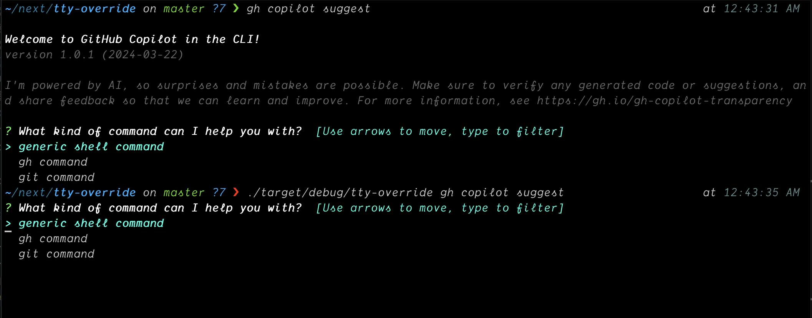

# tty-override

This is a simple script that allows you to override the stdout and stderr of a tty.
# Install
```
cargo install --git https://github.com/umutbasal/tty-override
```

## Usage

```sh
cat << EOF
[gh-copilot."*"]
rules = [
 ["Welcome.*\n", ""],
 ["version.*\n", ""],
 ["I'm powered.*\n", ""],
]
EOF > ~/tty-override/.config/config.toml
```

```sh
tty-override gh copilot suggest "list all files in the current directory"
```


